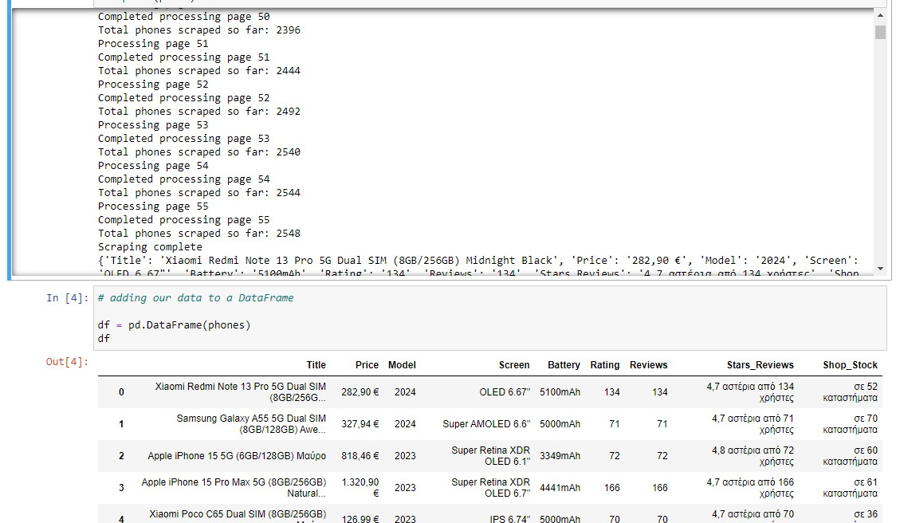

# Skroutz.gr Web scrape

# Description:

 This Python script is designed to scrape mobile phone listings from the Skroutz website. Here's a detailed description of what the code does:
 - **You can find the results of the web scraping script in the file project_web_scrape_dataset**
 - **You can find here the analysis of the dataset**

## Imports and Setup:

- The script imports necessary libraries: time for handling delays, BeautifulSoup for parsing HTML, UserAgent for generating random user agents, pandas for data manipulation, and urllib.request and urllib.error for handling web requests and errors.

## URL and Data Storage:

- The base URL for the mobile phone listings is defined.
- An empty list called phones is initialized to store details of each phone.

## Scraping Loop:

- The script loops through 55 pages of listings (from page 1 to 55).
- For each page, it constructs the URL and generates a random user agent to avoid being blocked by the website.

## Web Request Handling:

- It makes a request to the constructed URL and handles any HTTP or URL errors that may occur, printing an error message if a request fails.

## Parsing HTML with BeautifulSoup:

- If the request is successful, the page content is parsed using BeautifulSoup.
- It finds all list items (li elements) with the class cf card, which represent individual phone listings.

## Extracting Phone Details:

- For each listing, it creates a dictionary to store the phone's details.
- It extracts the title, price, model, screen size, battery, rating, number of reviews, star ratings, and shop availability. If a detail is not available, it assigns 'N/A'.

## Appending and Printing Data:

- The extracted details are appended to the phones list.
- After processing each page, it prints the current page number and the total number of phones scraped so far.
- A 10-second delay is added between requests to avoid overwhelming the server.
## Final Output:
- Once all pages are processed, it prints "Scraping complete".
- It prints the details of each scraped phone.

## Creating a DataFrame:

- The collected data is converted into a pandas DataFrame for further analysis or export.
- This script efficiently collects and organizes detailed information about mobile phones from the specified website, handling errors gracefully and ensuring compliance with the website's usage policies by incorporating delays and random user agents.

# Columns Description

The dataset contains information about mobile phone listings from Skroutz. The columns are as follows:

- Title: The name and description of the phone.
- Price: The price of the phone.
- Model: The model year of the phone.
- Screen: The type and size of the phone's screen.
- Battery: The battery capacity in mAh.
- Rating: The number of ratings the phone received.
- Reviews: The total number of reviews.
- Stars_Reviews: The star rating and count of reviewers.
- Shop_Stock: The number of shops where the phone is available.

-
